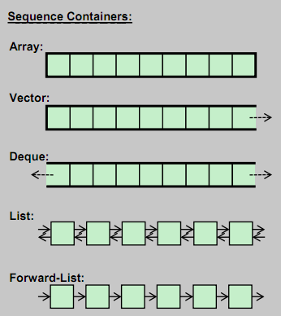

# Kontenery sekwencyjne

___

## Co to jest kontener sekwencyjny?

Jest to kontener, w którym elementy są przechowywane dokładnie w takiej kolejności, w jakiej je umieściliśmy.
<!-- .element: class="fragment fade-in" -->

___

## Jakie są różnice między nimi?

Powinniśmy rozważyć:
<!-- .element: class="fragment fade-in" -->

* <!-- .element: class="fragment fade-in-then-semi-out" --> Dostępne metody
* <!-- .element: class="fragment fade-in-then-semi-out" --> Ułożenie w pamięci
* <!-- .element: class="fragment fade-in-then-semi-out" --> Złożoność obliczeniową poszczególnych operacji

___

## [Kontenery STL na hackingcpp.com](https://hackingcpp.com/cpp/std/containers.html)

___

## Operacje wspólne

### Dla wszystkich kontenerów sekwencyjnych

| Operacje                  | Metody                                                                                  |
| :------------------------ | :-------------------------------------------------------------------------------------- |
| pierwszy element          | <!-- .element: class="fragment fade-in" -->  <code>front()</code>                       |
| czy kontener jest pusty   | <!-- .element: class="fragment fade-in" -->  <code>empty()</code>                                                                    |
| maksymalny rozmiar        | <!-- .element: class="fragment fade-in" -->  <code>max_size()</code>                                                                 |
| iterator początku/końca   | <!-- .element: class="fragment fade-in" -->  <code>begin()</code>, <code>end()</code>   |
| stały iterator            | <!-- .element: class="fragment fade-in" -->  <code>cbegin()</code>, <code>cend()</code> |
| podmiana całego kontenera | <!-- .element: class="fragment fade-in" -->  <code>swap()</code>                        |
