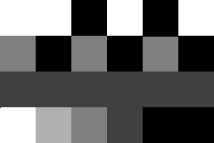
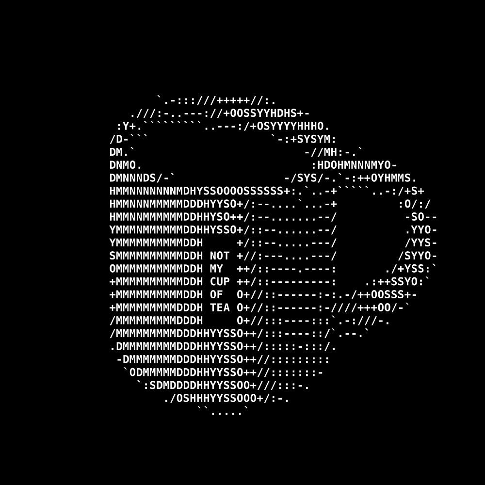

<!-- .slide: data-background="#111111" -->

# Kontenery sekwencyjne

## Praca domowa

<a href="https://coders.school">
    
</a>

___
<!-- .slide: style="font-size: 0.85em" -->

## Praca domowa

### Post-work

Ta praca domowa może już stanowić pewne wyzwanie. Działaj dużo z dokumentacją cppreference i najlepiej z kimś w parze lub nawet grupie 3-osobowej 🙂

* Poczytaj o formacie grafiki PGM - [Wiki ENG](https://en.wikipedia.org/wiki/Netpbm#File_formats). Ta wiedza może się przydać 🙂
* Zadanie 1 - `remove-vowels` (5 punktów)
* Zadanie 2 - `length-sort` (6 punktów)
* Zadanie 3 - `grayscale-image` (14 punktów)
  * Zadanie 3a - `compressGrayscale()`
  * Zadanie 3b - `decompressGrayscale()`

#### Bonusy

* **16.06.2021 (środa)** to ostatni dzień na zebranie bonusowych punktów za punktualność
* **3 XP** wpadną Ci za każde zadanie dostarczone w terminie (razem aż 9 punktów)
* **1 XP** za pracę w grupie dla każdej osoby z grupy za każde zadanie (razem 4 punkty dla każdej osoby). Zalecamy grupy 3 osobowe.

#### [Zadania w repo](https://github.com/coders-school/stl/blob/master/01-sequence-containers/08-homework.md)

___

### Pre-work

* Poczytaj coś więcej o złożoności obliczeniowej np. na [Samouczku programisty](https://www.samouczekprogramisty.pl/podstawy-zlozonosci-obliczeniowej/)
* Obejrzyj i zapamiętaj jaka jest [złożoność operacji na wszystkich kontenerach STL](https://github.com/gibsjose/cpp-cheat-sheet/blob/master/Data%20Structures%20and%20Algorithms.md). Poczytaj tam też o drzewach binarnych i różnych algorytmach sortowania.
* Znajdź na [cppreference.com](https://en.cppreference.com/w/) opisy algorytmów i zapoznaj się z nimi. Popatrz też na przykłady użycia.

___

## Zadanie 1 - `remove-Vowels`

Napisz funkcję `removeVowels()`, która przyjmie `std::vector<std::string>` oraz usunie wszystkie samogłoski z tych wyrażeń.

* Input: `{"abcde", "aabbbccabc", "qwerty"}`
* Output: `{"bcd", "bbccbc", "qwrt"}`

___

## Zadanie 2 - `length-sort`

Napisz funkcję `lengthSort()`.

Ma ona przyjąć `std::forward_list<std::string>` i zwrócić `std::deque<std::string>`
z posortowanymi słowami od najkrótszego do najdłuższego. Jeżeli dwa lub więcej słów ma tyle samo znaków
posortuj je leksykograficznie.

* Input: `std::forward_list<std::string>{"Three", "One", "Four", "Two"}`
* Output: `std::deque<std::string>{"One", "Two", "Four", "Three"}`

___
<!-- .slide: style="font-size: 0.85em" -->

## Zadanie 3 - `grayscale-image`

### Zadanie 3a - `compressGrayscale()`

Zadaniem będzie kompresja obrazka w odcieniach szarości o wymiarach 240x160 pikseli. Każdy piksel może mieć wartość od 0 (kolor czarny) do 255 (kolor biały). Im większa wartość tym jaśniejszy odcień piksel reprezentuje. Przykład małego obrazka o rozmiarach 6x4 piksele:



```cpp
255 255 0   255 0   255   // 0xFF 0xFF 0x00 0xFF 0x00 0xFF
128 0   128 0   128 0     // 0x80 0x00 0x80 0x00 0x80 0x00
64  64  64  64  64  64    // 0x40 0x40 0x40 0x40 0x40 0x40
255 192 128 64  0   0     // 0xFF 0xB0 0x80 0x40 0x00 0x00
```

Aby otrzymać z tego plik w formacie PGM wystarczy tylko dodać mu odpowiedni nagłówek.

___
<!-- .slide: style="font-size: 0.9em" -->

### Zadanie 3a - `compressGrayscale()` - opis

Napisz funkcję `compressGrayscale()`.
Powinna ona przyjąć jeden argument typu `std::array<std::array<uint8_t, 240>, 160>` określający rozkład odcieni szarości na obrazku 2D (który w dalszej części nazywać będziemy bitmapą) i zwróci `std::vector<std::pair<uint8_t, uint8_t>>` zawierający skompresowaną bitmapę.

Kompresja powinna przebiegać w następujący sposób:

* Bitmapę rysujemy od górnego lewego rogu przechodząc w prawo, następnie poziom niżej.
* Jeżeli obok siebie występuje ten sam kolor więcej niż 1 raz, funkcja powinna wrzucić do  `std::vector` wartość tego koloru (liczba z przedziału 0 – 255) jako pierwszy element pary oraz ilość jego powtórzeń jako drugi element pary.
* Jeżeli obok siebie występują różne odcienie to funkcja powinna wypełnić `std::vector` wartością odcienia oraz liczbą wystąpień równą 1 (w tym przypadku pogarszamy optymalizację, gdyż przechowujemy 2x tyle danych, jednak najczęściej te same kolory są położone obok siebie).

___
<!-- .slide: style="font-size: 0.9em" -->

### Zadanie 3a - `compressGrayscale()` - przykład

```cpp
input: {{0 0 0 1 1 2 3 0 0 0},
        {0 0 4 4 4 1 1 1 1 1},
        {2 2 2 2 2 1 2 2 2 2}}
output: {{0, 3}, {1, 2}, {2, 1}, {3, 1}, {0, 3}, {0, 2},
         {4, 3}, {1, 5}, {2, 5}, {1, 1}, {2, 4}}
```

W przypadku powyższej konwersji zamiast 30 bajtów (wymiary 10x3) zużyjemy 22 (11x2). Więc skompresowaliśmy dane o 26,7%.

Nie przejmujemy się na razie tym jak `uint_8` będzie zamieniany na kolor. Ważne w tym zadaniu jest, aby poćwiczyć korzystanie z kontenerów oraz wykonywania na nich różnych operacji.

Chętni mogą także zrefaktoryzować (czyli napisać czytelniej, ulepszyć) testy tak, aby te skomplikowane pętle, które wypełniają tablice były uniwersalną funkcją, możliwą do wywołania w obecnie istniejących i przyszłych testach (podobnie jak funkcja `getBitmap()`).
Po wydzieleniu i refaktoringu funkcji generującej, postarajcie się dopisać także przypadki dla 1/16, 1/32 i 1/64 bitmapy.

___
<!-- .slide: data-background="../img/jjfile1_002.png" -->

___

### Zadanie 3b - `decompressGrayscale()`

Napisz funkcję `decompressGrayscale()`, która zdekompresuje obrazek skompresowany w zadaniu 3a za pomocą funkcji `compressGrayscale()`.

Jako argument funkcja `decompressGrayscale()` przyjmie `std::vector<std::pair<uint8_t, uint8_t>>` natomiast zwróci `std::array<std::array<uint8_t, 240>, 160>` i przeprowadzi operacje mające na celu rekonstrukcję pierwotnego formatu bitmapy.

___

### Implementacja

Stwórz odpowiedni plik nagłówkowy (hpp) oraz źródłowy (cpp). W pliku nagłówkowym zdefiniuj stałe dotyczące rozmiaru w taki sposób:

```cpp
constexpr size_t width = 32;
constexpr size_t height = 32;
```

Dzięki temu będzie Ci łatwiej zmienić rozmiar obrazka w celach testowych, bo wystarczy to zrobić tylko w jednym miejscu. W testach też są używane takie same nazwy stałych.

___

## ASCII art

Dla chętnych (bez punktów) polecamy także napisać sobie funkcję `printMap()`, która wyświetli bitmapę.
Domyślnie `std::cout` potraktuje `uint8_t` jako `unsigned char`, dlatego też możecie sobie wypisać bitmapę z kodów ASCII.



Jeśli chcesz zrobić to zadanie (nie ma za nie dodatkowych punktów) to zaimplementuj zakomentowaną w main.cpp funkcję `printMap()`. Jej implementację wrzuć do pliku z funkcjami `compressGrayscale()` i `decompressGrayscale()`. Jej prawidłowa implementacja i odpalenie funkcji `main()` poprzez wywołanie `./grayscale-image` powinna wyświetlić ninję na ekranie :)

Rozmiar ninjy odczytaj z main.cpp. Musisz zmienić stałe związane z rozmiarem, aby udało Ci się wyświetlić ninję. Jeśli Ci się uda, to pochwal się tym na Discordzie :)

___

Chętni mogą także zrefaktoryzować testy, tak by funkcja sprawdzająca bitmapę była generyczna (adekwatnie do funkcji `expectBitmap()`.
Po refaktoringu funkcji sprawdzającej, postaraj się dopisać także przypadki dla 1/16, 1/32 i 1/64 mapy.
