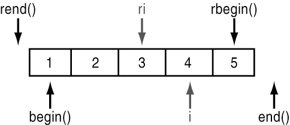

<!-- .slide: data-background="#111111" -->

# Iteratory

___

## Co to jest iterator?

Iterator jest to obiekt, który wskazuje na element w kontenerze.
<!-- .element: class="fragment fade-in" -->

W zależności od typu możemy na nim wykonywać różne operacje, np. inkrementować (`operator++`), dekrementować (`operator--`) lub wykonywać operacje typu `it += 6`.
<!-- .element: class="fragment fade-in" -->

W celu odwołania się do wskazywanego elementu przez iterator używamy `operator*` czyli dereferencji (jak na wskaźnikach).
<!-- .element: class="fragment fade-in" -->

Iterator to wzorzec projektowy, który określa obiekt umożliwiający poruszanie się po jakiejś kolekcji.
<!-- .element: class="fragment fade-in" -->

Ciekawostka: wskaźnik też jest iteratorem, bo spełnia jego założenia.
<!-- .element: class="fragment fade-in" -->
___

## Początek i koniec

Każdy kontener ma początek i koniec.
<!-- .element: class="fragment fade-in" -->

* <!-- .element: class="fragment fade-in" --> Na początek wskazuje iterator <code>begin()</code>
* <!-- .element: class="fragment fade-in" --> Na koniec wskazuje iterator <code>end()</code> (w uproszczeniu)
* <!-- .element: class="fragment fade-in" --> W praktyce <code>end()</code> wskazuje na miejsca za ostatnim elementem.


<!-- .element: class="fragment fade-in" -->

___

## Odwrotne iteratory

Dla niektórych kontenerów możemy także pobrać odwrotny iterator (ang. reverse iterator) umożliwiający nam przejście wstecz przez zakres.
<!-- .element: class="fragment fade-in" -->

* <!-- .element: class="fragment fade-in" --> Iterator <code>rbegin()</code> wskazuje na ostatni element
* <!-- .element: class="fragment fade-in" --> Iterator <code>rend()</code> wskazuje na mniejsce przed pierwszym elementem


<!-- .element: class="fragment fade-in" -->

___

## Iteratory na stałe

Jeżeli nie chcemy modyfikować danych wskazywanych przez iterator wybierzemy iteratory z przedrostkiem `c` pochodzącym od słowa `const`.

* <!-- .element: class="fragment fade-in" --> <code>cbegin()</code>
* <!-- .element: class="fragment fade-in" --> <code>cend()</code>
* <!-- .element: class="fragment fade-in" --> <code>crbegin()</code>
* <!-- .element: class="fragment fade-in" --> <code>crend()</code>

___

## Hierarchia iteratorów


Mamy 6 typów iteratorów:
<!-- .element: class="fragment fade-in" -->

* <!-- .element: class="fragment fade-in" --> <code>InputIt</code>
* <!-- .element: class="fragment fade-in" --> <code>OutputIt</code>
* <!-- .element: class="fragment fade-in" --> <code>ForwardIt</code>
* <!-- .element: class="fragment fade-in" --> <code>BidirectionalIt</code>
* <!-- .element: class="fragment fade-in" --> <code>RandomAccessIt</code>
* <!-- .element: class="fragment fade-in" --> <code>ContiguousIt</code>

___

## Input iterator
<!-- .element: class="fragment fade-in" -->

* <!-- .element: class="fragment fade-in" --> Przykład: strumień <code>std::istream</code>, taki jak <code>std::cin</code>
* <!-- .element: class="fragment fade-in" --> Raz wczytane dane znikają, nie możemy ich ponownie odczytać
* <!-- .element: class="fragment fade-in" --> Mamy możliwość tylko jednorazowego przejścia przez dane
* <!-- .element: class="fragment fade-in" --> Można powiedzieć, że iterator jest automatycznie inkrementowany
<!-- .element: class="fragment fade-in" -->

```cpp
int a;
int b;
std::cin >> a >> b;
```
<!-- .element: class="fragment fade-in" -->

___

## Output iterator

* <!-- .element: class="fragment fade-in" --> Przykład: strumień <code>std::ostream</code>, taki jak <code>std::cout</code>.
* <!-- .element: class="fragment fade-in" --> Raz wypisane dane znikają, nie możemy ich ponownie wyświetlić, musimy ponownie podać dane.

```cpp
int a;
int b;
std::cin >> a >> b;
std::cout << a << ' ' << b;
```
<!-- .element: class="fragment fade-in" -->
___

### Pytanie

Jakie mamy dostępne operatory dla input iterator, a jakie dla output iterator?

Input iterator:
<!-- .element: class="fragment fade-in" -->

* <!-- .element: class="fragment fade-in" --> <code>operator++</code>
* <!-- .element: class="fragment fade-in" --> <code>operator*</code>
* <!-- .element: class="fragment fade-in" --> <code>operator-></code>
* <!-- .element: class="fragment fade-in" --> <code>operator==</code>
* <!-- .element: class="fragment fade-in" --> <code>operator!=</code>

Output iterator:
<!-- .element: class="fragment fade-in" -->

* <!-- .element: class="fragment fade-in" --> <code>operator++</code>
* <!-- .element: class="fragment fade-in" --> <code>operator*</code>

___

## Forward iterator

Jest to iterator, który umożliwia nam wielokrotne przejście danego zakresu w jedną stronę (w przód).

```cpp
std::forward_list<int> list {1, 2, 3, 4, 5};
for (auto it = list.begin() ; it != list.end() ; ++it) {
    std::cout << *it << '\n';
}
```
<!-- .element: class="fragment fade-in" -->

Output: `1 2 3 4 5`
<!-- .element: class="fragment fade-in" -->

___

### Pytanie - operatory

Jakie mamy dostępne operatory dla forward iteratora?
<!-- .element: class="fragment fade-in" -->

* <!-- .element: class="fragment fade-in" --> <code>operator++</code>
* <!-- .element: class="fragment fade-in" --> <code>operator*</code>
* <!-- .element: class="fragment fade-in" --> <code>operator-></code>
* <!-- .element: class="fragment fade-in" --> <code>operator==</code>
* <!-- .element: class="fragment fade-in" --> <code>operator!=</code>

___

### Pytanie - przykłady

Jakie kontenery posiadają iteratory typu `ForwardIt`?
<!-- .element: class="fragment fade-in" -->

* <!-- .element: class="fragment fade-in" --> <code>std::forward_list<T></code>
* <!-- .element: class="fragment fade-in" --> <code>std::unordered_set<T></code>
* <!-- .element: class="fragment fade-in" --> <code>std::unordered_map<T></code>
* <!-- .element: class="fragment fade-in" --> <code>std::unordered_multiset<T></code>
* <!-- .element: class="fragment fade-in" --> <code>std::unordered_multimap<T></code>

___

## Bidirectional iterator

Jest to iterator, który umożliwia nam wielokrotne przejście danego zakresu w obie strony (w przód i tył).

```cpp [5-8]
std::list<int> list{1, 2, 3, 4, 5};
for (auto it = list.begin(); it != list.end(); ++it) {
    std::cout << *it << ' ';
}
auto last = std::prev(list.end());
for (auto it = last; it != std::prev(list.begin()); --it) {
    std::cout << *it << ' ';
}
```
<!-- .element: class="fragment fade-in" -->

Output: `1 2 3 4 5 5 4 3 2 1`
<!-- .element: class="fragment fade-in" -->

___

### Pytanie - operatory

Jakie mamy dostępne operatory dla `BidirectionalIt`?
<!-- .element: class="fragment fade-in" -->

* <!-- .element: class="fragment fade-in" --> <code>operator++</code>
* <!-- .element: class="fragment fade-in" --> <code>operator*</code>
* <!-- .element: class="fragment fade-in" --> <code>operator-></code>
* <!-- .element: class="fragment fade-in" --> <code>operator==</code>
* <!-- .element: class="fragment fade-in" --> <code>operator!=</code>
* <!-- .element: class="fragment fade-in" --> <code class="fragment highlight-green">operator--</code>

___

### Pytanie - przykłady

Pomyśl lub sprawdź na cppreference jakie kontenery posiadają iteratory typu `BidirectionalIt`?
<!-- .element: class="fragment fade-in" -->

* <!-- .element: class="fragment fade-in" --> <code>std::list<T></code>
* <!-- .element: class="fragment fade-in" --> <code>std::set<T></code>
* <!-- .element: class="fragment fade-in" --> <code>std::map<T></code>
* <!-- .element: class="fragment fade-in" --> <code>std::multiset<T></code>
* <!-- .element: class="fragment fade-in" --> <code>std::multimap<T></code>

___

## Random Access iterator

Jest to iterator, który dodatkowo umożliwia nam dostęp do dowolnego elementu.

```cpp [9-10]
std::vector<int> vec{1, 2, 3, 4, 5};
for (auto it = vec.begin(); it != vec.end(); ++it) {
    std::cout << *it << ' ';
}
auto last = std::prev(vec.end());
for (auto it = last; it != std::prev(vec.begin()); --it) {
    std::cout << *it << ' ';
}
auto third = std::begin(vec) + 2;
std::cout <<  vec[3] << ' ' << *third;
```
<!-- .element: class="fragment fade-in" -->

Output: `1 2 3 4 5 5 4 3 2 1 4 3`
<!-- .element: class="fragment fade-in" -->

___

### Pytanie - operatory

Jakie mamy dostępne operatory dla `RandomAccessIt`?
<!-- .element: class="fragment fade-in" -->

* <!-- .element: class="fragment fade-in" --> <code>operator++</code>
* <!-- .element: class="fragment fade-in" --> <code>operator*</code>
* <!-- .element: class="fragment fade-in" --> <code>operator-></code>
* <!-- .element: class="fragment fade-in" --> <code>operator==</code>
* <!-- .element: class="fragment fade-in" --> <code>operator!=</code>
* <!-- .element: class="fragment fade-in" --> <code>operator--</code>
* <!-- .element: class="fragment fade-in" --> <code class="fragment highlight-green">operator<</code>
* <!-- .element: class="fragment fade-in" --> <code class="fragment highlight-green">operator<=</code>
* <!-- .element: class="fragment fade-in" --> <code class="fragment highlight-green">operator></code>
* <!-- .element: class="fragment fade-in" --> <code class="fragment highlight-green">operator>=</code>
* <!-- .element: class="fragment fade-in" --> <code class="fragment highlight-green">operator+</code>
* <!-- .element: class="fragment fade-in" --> <code class="fragment highlight-green">operator-</code>
* <!-- .element: class="fragment fade-in" --> <code class="fragment highlight-green">operator[]</code>

___

### Pytanie - przykłady

Pomyśl lub sprawdź na cppreference jakie kontenery posiadają iteratory typu `RandomAccessIt`?
<!-- .element: class="fragment fade-in" -->

* <!-- .element: class="fragment fade-in" --> <code>std::deque<T></code>

Tylko ten?
<!-- .element: class="fragment fade-in" -->

A co z `std::vector` i `std::array`?
<!-- .element: class="fragment fade-in" -->

___

## Contiguous Iterator

Wprowadzony w C++ 17. Zawiera on wszystkie cechy Random Access iterator oraz zapewnia, że wszystkie dane są ułożone w jednym miejscu w pamięci.
<!-- .element: class="fragment fade-in" -->

Ten iterator nie ma żadnych dodatkowych operacji ponad to co oferuje `RandomAccessIt`.
<!-- .element: class="fragment fade-in" -->

### Przykłady
<!-- .element: class="fragment fade-in" -->

* <!-- .element: class="fragment fade-in" --> <code>std::vector<T></code>
* <!-- .element: class="fragment fade-in" --> <code>std::array<T></code>
* <!-- .element: class="fragment fade-in" --> <code>std::string</code>

___

### [Zobacz Iterator library na cppreference.com](https://en.cppreference.com/w/cpp/iterator)

___

## Ważna uwaga

Każdy iterator wyżej w hierarchii spełnia wymagania tego, który jest niżej.

Np. Random Access Iterator jest też Forward Iteratorem.


