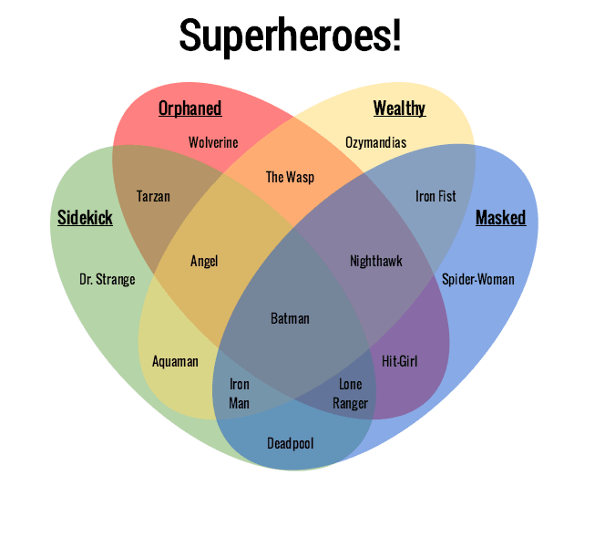
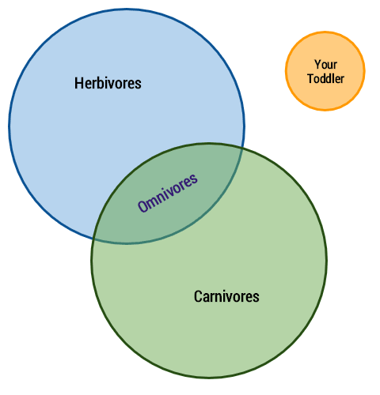

<!-- .slide: data-background="#111111" -->

# Algorytmy dla zbiorów

<a href="https://coders.school">
    
</a>

___

## Diagramy Venna



### [Źródło](https://www.gliffy.com/blog/what-venn-diagram-venn-diagram-types-templates)

___

## Zawieranie - `includes`


```cpp
std::vector<int> v1 {1, 2, 5, 5, 5, 9};
std::vector<int> v2 {2, 5, 7};

std::includes(v1.begin(), v1.end(), v2.begin(), v2.end());  // false
```
<!-- .element: class="fragment fade-in" -->

___

## Zawieranie...



___

## Suma zbiorów - `union`

```cpp
std::vector<int> v1 {1, 2, 5, 5, 5, 9};
std::vector<int> v2 {2, 5, 7};
std::vector<int> union;
std::set_union(v1.begin(), v1.end(),
               v2.begin(), v2.end(),
               std::back_inserter(union));
// union = {1, 2, 2, 5, 5, 5, 5, 7, 9}
```
<!-- .element: class="fragment fade-in" -->

___

## Część wspólna - `intersection`

```cpp
std::vector<int> v1 {1, 2, 5, 5, 5, 9};
std::vector<int> v2 {2, 5, 7};
std::vector<int> intersection;
std::set_intersection(v1.begin(), v1.end(),
                      v2.begin(), v2.end(),
                      std::back_inserter(intersection));
// intersection = {2, 5}
```
<!-- .element: class="fragment fade-in" -->

___

## Różnica symetryczna - `symmetric_difference`

```cpp
std::vector<int> v1 {1, 2, 5, 5, 5, 9};
std::vector<int> v2 {2, 5, 7};
std::vector<int> symmetric_diff;
std::set_symmetric_difference(v1.begin(), v1.end(),
                              v2.begin(), v2.end(),
                              std::back_inserter(symmetric_diff));
// symmetric_diff = {1, 5, 5, 7, 9}
```
<!-- .element: class="fragment fade-in" -->

___

## Różnica - `difference`

```cpp
std::vector<int> diff;
std::set_difference(v1.begin(), v1.end(),
                    v2.begin(), v2.end(),
                    std::back_inserter(diff));
// diff = {1, 5, 5, 9}
```
<!-- .element: class="fragment fade-in" -->
