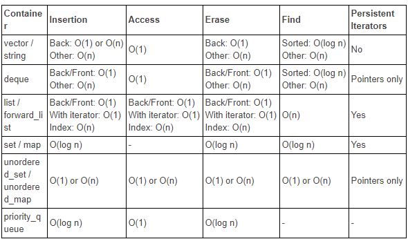

<!-- .slide: data-background="#111111" -->

# Kontenery asocjacyjne

___

## Co to jest kontener asocjacyjny?

To taki kontener, w którym elementy są przechowywane w z góry określonej kolejności (tak, nie ma to nic wspólnego z nazwą).
<!-- .element: class="fragment fade-in" -->

Po nazwie należałoby powiedzieć, że kontener asocjacyjny (czyli skojarzeniowy) to taki słownik (`dict`) z Pythona, czyli przechowuje skojarzenia a -> b. Inaczej, można też powiedzieć, że robi on mapowanie elementów jednego typu na drugi.
<!-- .element: class="fragment fade-in" -->

Ale to nie jest prawdą dla kontenerów typu `*set<T>`, które stanowią tylko zbiory danych.
<!-- .element: class="fragment fade-in" -->

___

## Uporządkowane (posortowane)

* <!-- .element: class="fragment fade-in" --> <code>set</code>
* <!-- .element: class="fragment fade-in" --> <code>multiset</code>
* <!-- .element: class="fragment fade-in" --> <code>map</code>
* <!-- .element: class="fragment fade-in" --> <code>multimap</code>

Są one reprezentowane przez struktury danych, które pozwalają na szybkie przeszukiwanie ze złożonością logarytmiczną `O(log n)`.
<!-- .element: class="fragment fade-in" -->

Te struktury danych to drzewa binarne.
<!-- .element: class="fragment fade-in" -->

___

## Nieuporządkowane - Unordered (hashed)

* <!-- .element: class="fragment fade-in" --> <code>unordered_set</code>
* <!-- .element: class="fragment fade-in" --> <code>unordered_multiset</code>
* <!-- .element: class="fragment fade-in" --> <code>unordered_map</code>
* <!-- .element: class="fragment fade-in" --> <code>unordered_multimap</code>

Kontenery nieuporządkowane są reprezentowane przez struktury danych, które pozwalają na szybkie przeszukiwanie ze złożonością stałą `O(1)` (w średnim przypadku).
<!-- .element: class="fragment fade-in" -->

Po co więc w ogóle używać kontenerów uporządkowanych, skoro nieuporządkowane są szybsze?
<!-- .element: class="fragment fade-in" -->

Bo nieuporządkowane mają gorszą złożoność pesymistycznego przypadku - `O(n)`, czyli liniową.
<!-- .element: class="fragment fade-in" -->

Te struktury danych to mapy hashujące, zwane też tablicami hashującymi, hashmapami. Natkniesz się też na nazwy typu mapy mieszające.
<!-- .element: class="fragment fade-in" -->

___
<!-- .slide: data-background="../img/associative_containers.png" data-background-size="contain" -->

___

## Jakie są różnice pomiędzy tymi wszystkimi kontenerami?

Możemy rozważyć to na kilku płaszczyznach:
<!-- .element: class="fragment fade-in" -->

* <!-- .element: class="fragment fade-in-then-semi-out" --> Uporządkowanie
  * <!-- .element: class="fragment fade-in-then-semi-out" --> posortowane, nieuporządkowane
* <!-- .element: class="fragment fade-in-then-semi-out" --> Przechowywane dane
  * <!-- .element: class="fragment fade-in-then-semi-out" --> pojedyncze, podwójne
* <!-- .element: class="fragment fade-in-then-semi-out" --> Unikalność elementów
  * <!-- .element: class="fragment fade-in-then-semi-out" --> bez duplikatów, z duplikatami
* <!-- .element: class="fragment fade-in-then-semi-out" --> Zużycie pamięci
  * <!-- .element: class="fragment fade-in-then-semi-out" --> drzewa binarne, tablice hashujące
* <!-- .element: class="fragment fade-in-then-semi-out" --> Złożoność przeszukiwania
* <!-- .element: class="fragment fade-in-then-semi-out" --> Złożoność dostępu do konkretnego elementu
* <!-- .element: class="fragment fade-in-then-semi-out" --> Złożoność wstawiania i usuwania elementów

___

## Złożoność operacji

