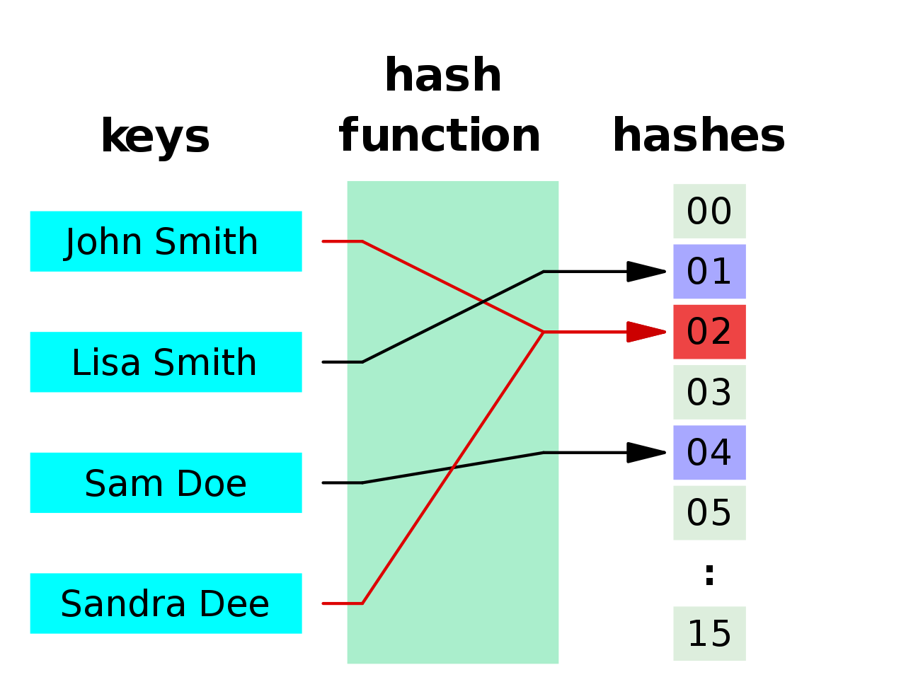

<!-- .slide: data-background="#111111" -->

# Hashowanie

<a href="https://coders.school">
    
</a>

___

## Hash Table


___

## Funkcja skrótu (hash function)

Jest to funkcja, która z dowolnego obiektu wygeneruje nam index w tablicy hashującej. Innymi słowy, mapuje ona dane dowolnej długości na wartości o stałej długości.



___
<!-- .slide: style="font-size: 0.8em" -->
## Oceńmy poniższe funkcje skrótu

```cpp
size_t hash(const std::string& str) { return str.size(); }
```
<!-- .element: class="fragment fade-in" -->

Dobra funkcja skrótu jest jednokierunkowa, czyli ciężko wymyślić dla jakiego argumentu zwróci konkretny wynik.
<!-- .element: class="fragment fade-in" -->

```cpp
size_t hash(const std::string& str) {
    size_t index = 0;
    for (size_t i = 0 ; i < str.size() ; ++i) {
        index += (int)str[i];
    }
    return index;
}
```
<!-- .element: class="fragment fade-in" -->

Dobra funkcja skrótu powoduje dużą zmianę bitów wyjściowych (ok. 50% zmienionych bitów) zmieniając tylko jeden bit wejściowy.
<!-- .element: class="fragment fade-in" -->

```cpp
size_t hash(const std::string& str) {
    size_t index = 0;
    for (size_t i = 0 ; i < str.size() - 1 ; ++i) {
        index += ((int)str[i] * int(str[i + 1]) * (i + 5)) & (((int)str[i] + int(str[i + 1]) * i * i));
    }
    return index * str.size();
}
```
<!-- .element: class="fragment fade-in" -->

___

## [`std::hash` na cppreference.org](https://en.cppreference.com/w/cpp/utility/hash)
