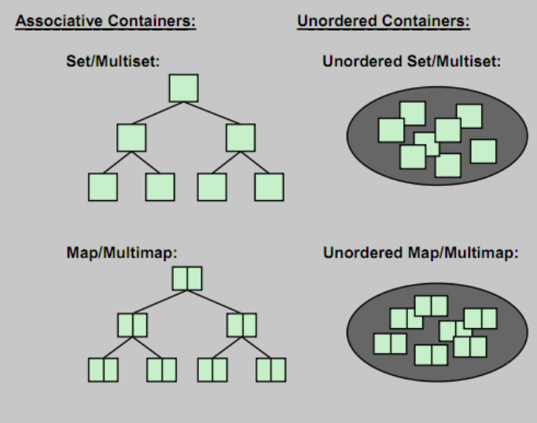

<!-- .slide: data-background="#111111" -->

# Associative containers

## Summary

___

## What do you remember about associative containers?

1. <!-- .element: class="fragment fade-in" --> 8 containers - mention them
2. <!-- .element: class="fragment fade-in" --> Which of them are cache-friendly?
3. <!-- .element: class="fragment fade-in" --> Operations complexity
4. <!-- .element: class="fragment fade-in" --> Memory consumption
5. <!-- .element: class="fragment fade-in" --> Iterators invalidation

___

___

