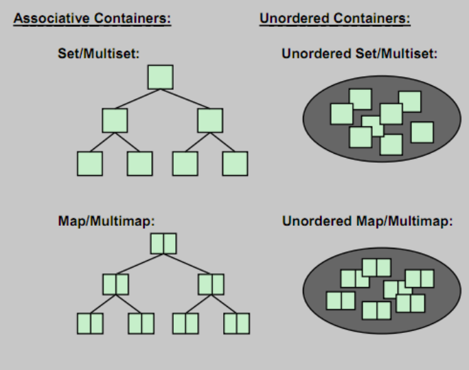
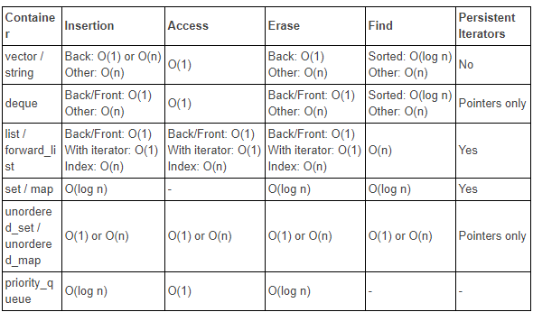

<!-- .slide: data-background="#111111" -->

# Kontenery asocjacyjne

## Podsumowanie

___

## Co pamiętasz na temat kontenerów asocjacyjnych?

Zapisz odpowiedzi na poniższe pytania w notatkach do tej lekcji

1. <!-- .element: class="fragment fade-in" --> Wymień je wszystkie
2. <!-- .element: class="fragment fade-in" --> Które z nich są cache-friendly?
3. <!-- .element: class="fragment fade-in" --> Jakie są złożoności operacji na nich?
4. <!-- .element: class="fragment fade-in" --> Jak są zaimplementowane?
5. <!-- .element: class="fragment fade-in" --> Kiedy unieważniane są iteratory?

___

___

