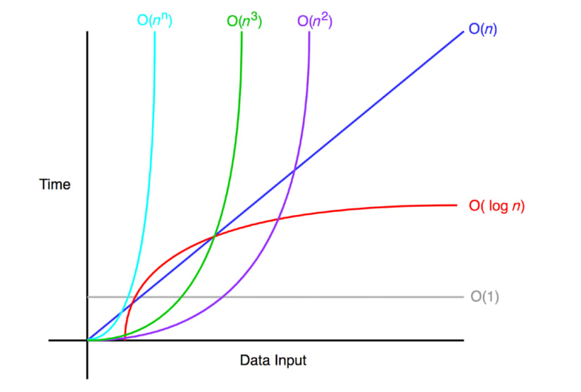
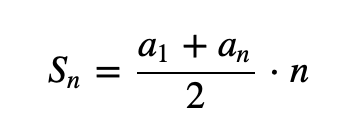

<!-- .slide: data-background="#111111" -->

# Złożoność obliczeniowa

<a href="https://coders.school">
    
</a>

___

## Quiz

Ułóż w kolejności rosnącej poszczególne złożoności obliczeniowe

* liniowa
* wykładnicza
* stała
* logarytmiczna
* silnia
* liniowo-logarytmiczna
* wielomianowa

___

## Odpowiedź

1. <!-- .element: class="fragment fade-in" --> <code>O(1)</code> <span class="fragment fade-in">stała</span>
2. <!-- .element: class="fragment fade-in" --> <code>O(logn)</code> <span class="fragment fade-in">logarytmiczna</span>
3. <!-- .element: class="fragment fade-in" --> <code>O(n)</code> <span class="fragment fade-in">liniowa</span>
4. <!-- .element: class="fragment fade-in" --> <code>O(nlogn)</code> <span class="fragment fade-in">liniowo-logarytmiczna </span>
5. <!-- .element: class="fragment fade-in" --> <code>O(n^x)</code> <span class="fragment fade-in">wielomianowa</span>
6. <!-- .element: class="fragment fade-in" --> <code>O(x^n)</code> <span class="fragment fade-in">wykładnicza</span>
7. <!-- .element: class="fragment fade-in" --> <code>O(n!)</code> <span class="fragment fade-in">silnia</span>

___

## Złożoność obliczeniowa



___

## Definicja

Złożoność obliczeniowa to oszacowanie czasu wykonania algorytmu. Mierzymy liczbę operacji w zależności od wielkości zbioru wejściowego `n` i szukamy funkcji opisującej zależność liczby tych operacji od danych wejściowych.
<!-- .element: class="fragment fade-in" -->

Notacja `O` (dużego O) jest oszacowaniem z góry. Chcemy tylko znać rząd wielkości, dlatego pomijamy wszelkiego rodzaju stałe, które nie mają znaczenia dla dużych zbiorów danych wejściowych.
<!-- .element: class="fragment fade-in" -->

___

## Własności notacji `O`

* <!-- .element: class="fragment fade-in" --> stałe nie mają znaczenia, więc je pomijamy
  * `Ο(1/50n) = Ο(2n) = Ο(n)`
* <!-- .element: class="fragment fade-in" --> mniejsze rzędy wielkości nie mają znaczenia, więc je pomijamy
  * `O(n^2 + n) = O(n^2 + logn + 1) = O(n^2)`

___

## Złożoność stała - `O(1)`

Czas wykonania algorytmu nie zależy od wielkości danych wejściowych.

### Przykład `O(1)`
<!-- .element: class="fragment fade-in" -->

Obliczanie sumy ciągu arytmetycznego. Nie iterujemy po wszystkich elementach tablicy, zatem czas wykonania jest stały i niezależny od długości ciągu.
<!-- .element: class="fragment fade-in" -->



___

### Przykład `O(1)`

```cpp
int sum(const std::vector<int>& vec) {
    if (vec.empty()) {
        return 0;
    }
    return (vec.front() + vec.back()) * vec.size() / 2;
}

int main() {
    std::cout << sum({1, 2, 3, 4, 5, 6}) << '\n';
    return 0;
}
```
<!-- .element: class="fragment fade-in" -->

Output: `21`
<!-- .element: class="fragment fade-in" -->

___

## Złożoność logarytmiczna - `O(logn)`

Wyobraźmy sobie, że szukamy numeru telefonu naszego kolegi Andrzeja. Bierzemy książkę telefoniczną i otwieramy ją na środku i patrzymy, że wypada nam osoba o imieniu Kornelia. Wiemy, że Andrzej jest w pierwszej połowie książki adresowej, gdyż litera K jest dużo dalej w alfabecie niż litera A. Zatem znów otwieramy na środku pierwszej połowy i patrzymy, że widnieje tam imię Dominik. Powtarzamy więc nasze szukanie natrafiając w kolejnej części na Bartka, aż w końcu trafiamy na Andrzeja. Takie przeszukiwanie, w którym za każdym razem odrzucamy połowę zakresu jest właśnie zapisywane w notacji `O(logn)`.

___

### Przykład `O(logn)`

```cpp
std::vector<int> vec{1, 2, 3, 4, 5, 6};
std::cout << std::boolalpha
          << std::binary_search(begin(vec), end(vec), 2) << std::endl
          << std::binary_search(begin(vec), end(vec), 0) << std::endl;
```
<!-- .element: class="fragment fade-in" -->

Output:
<!-- .element: class="fragment fade-in" -->

```cpp
true
false
```
<!-- .element: class="fragment fade-in" -->

___

## Złożoność liniowa - `O(n)`

Wyobraźmy sobie teraz sytuację, że w książce adresowej szukamy numeru Żanety. Jednak nie będziemy teraz przeszukiwać binarnie, tylko sprawdzimy ile zajmie nam to, gdy będziemy szukać osoba po osobie. Więc zaczynamy od litery A i kilka minut później znajdujemy w końcu numer Żanety 🙂. Taka złożoność, gdzie sprawdzamy po kolei każdy element jest złożonością `O(n)`.

___
<!-- .slide: style="font-size: 0.85em" -->

## Przykład `O(n)`

```cpp
using namespace std::chrono;
constexpr size_t samples = 1'000'000'000;
constexpr size_t search_num = 987'654'321;
std::vector<int> vec(samples);
std::iota(begin(vec), end(vec), 0);

auto start = high_resolution_clock::now();
std::binary_search(begin(vec), end(vec), search_num);
auto stop = high_resolution_clock::now();
std::cout << "O(logn): " << duration_cast<nanoseconds>(stop - start).count() << " ns\n";

start = high_resolution_clock::now();
for (const auto el : vec) {
    if (el == search_num) {
        break;
    }
}
stop = high_resolution_clock::now();
std::cout << "O(n): " << duration_cast<nanoseconds>(stop - start).count() << " ns\n";
```

Example output:
<!-- .element: class="fragment fade-in" -->

```cpp
O(logn): 0 ns
O(n): 6'949'430'300 ns
```
<!-- .element: class="fragment fade-in" -->

___

## Złożoność liniowo-logarytmiczna - `O(nlogn)`

Wyobraźmy sobie teraz sytuację: próbujemy znaleźć numer Andrzeja w książce telefonicznej, ale nasz kolega zrobił nam psikus i pozamieniał strony. Teraz musimy ją posortować, zależy nam na czasie, więc chcemy to zrobić wydajnie. Dlatego wyrywamy kolejno strony z książki telefonicznej i wstawiamy je do nowej w zgodnej kolejności. Nie dość, że musimy zrobić taką operację dla `n` stron, to jeszcze musimy wstawiać je alfabetycznie, co zajmie nam `logn` czasu. Dlatego cały proces to `nlogn`.

___

## Przykład `O(nlogn)`

```cpp
using namespace std::chrono;
constexpr size_t samples = 1'000'000'000;
std::vector<int> vec(samples);
std::iota(begin(vec), end(vec), 0);
std::random_device rd;
std::mt19937 gen(rd());

//Here our colleague mixed up phone book.
std::shuffle(begin(vec), end(vec), gen);
auto start = high_resolution_clock::now();
std::sort(begin(vec), end(vec));
auto stop = high_resolution_clock::now();
std::cout << "O(nlogn): " << duration_cast<nanoseconds>(stop - start).count() << " ns\n";
```
<!-- .element: class="fragment fade-in" -->

Possible output: `O(nlogn): 499'694'684'900 ns`
<!-- .element: class="fragment fade-in" -->

Poprzedni output: `O(n): 6'949'430'300 ns`
<!-- .element: class="fragment fade-in" -->

___

## Złożoność wielomianowa - `O(n^x)`

Jej szczególnym i bardzo częstym przypadkiem jest złożoność kwadratowa - `O(n^2)`, której czas wykonania jest wprost proporcjonalny do kwadratu ilości danych wejściowych.
<!-- .element: class="fragment fade-in" -->

Wyobraźmy sobie teraz inną sytuację. Udało nam się znaleźć numer Andrzeja i postanawiamy również zrobić psikus naszemu koledze, ale chcemy odwdzięczyć się z nawiązką. Dlatego drukujemy nową książkę telefoniczną, ale do każdego numeru dodajemy cyferkę '8' na początku numeru. Teraz nasz kolega nie dość, że musi poprawić każdą stronę `n` to jeszcze sprawdzić i poprawić każdy numer na podstawie oryginalnej książki. Taka złożoność obliczeniowa to `O(n^2)`. Przykładem złożoności `O(n^2)` jest popularne [sortowanie bąbelkowe](https://en.wikipedia.org/wiki/Bubble_sort).
<!-- .element: class="fragment fade-in" -->

___
<!-- .slide: style="font-size: 0.7em" -->

## Przykład `O(n^2)`

```cpp
using namespace std::chrono;
constexpr size_t samples = 1'000'000;
std::vector<int> vec(samples);
std::iota(begin(vec), end(vec), 0);
auto start = high_resolution_clock::now();
BubleSort(vec);
auto stop = high_resolution_clock::now();
std::cout << "O(n^2): " << duration_cast<nanoseconds>(stop - start).count() << " ns\n";

constexpr size_t samples2 = 10'000'000;  // size is 10 times higher.
std::vector<int> vec2(samples2);
std::iota(begin(vec2), end(vec2), 0);
start = high_resolution_clock::noaw();
BubleSort(vec2);
stop = high_resolution_clock::now();
std::cout << "O(n^2): " << duration_cast<nanoseconds>(stop - start).count() << " ns\n";

constexpr size_t samples3 = 100'000'000;  // size is 100 times higher.
std::vector<int> vec3(samples3);
std::iota(begin(vec3), end(vec3), 0);
start = high_resolution_clock::now();
BubleSort(vec3);
stop = high_resolution_clock::now();
std::cout << "O(n^2): " << duration_cast<nanoseconds>(stop - start).count() << " ns\n";
```
<!-- .element: class="fragment fade-in" -->

Possible output:
<!-- .element: class="fragment fade-in" -->

```cpp
O(n^2): 9'974'800 ns
O(n^2): 83'777'600 ns
O(n^2): 810'269'600 ns
```
<!-- .element: class="fragment fade-in" -->

___

## Złożoność wykładnicza -  `O(x^n)`

Wyobraźmy sobie sytuację, w której nie dość, że książka zawiera błędy, które wcześniej celowo wprowadziliśmy, ale ktoś postanowił ją wydrukować w olbrzymim nakładzie i teraz musimy poprawić wszystkie książki, w których już czas poprawiania błędów wynosi `n^2`. Dla takiej kombinacji mówimy, że złożoność jest `n^n`. Czyli rośnie wykładniczo wraz ze wzrostem liczby książek (próbek). Przykładem może być algorytm przeszukiwania grafu DFS (deep-first search), jeżeli danymi wejściowymi będzie macierz. Ponieważ za każdym razem musimy przejść cały rząd, aż znajdziemy interesujący nas element, więc wykonamy `n^n` kroków. Rzadko spotykane, więc jest formą ciekawostki 🙂

___

## Złożoność `O(n!)`

Przykładem problemu jest problem komiwojażera z grupy algorytmów grafowych. Należy znaleźć najkrótszą trasę rozpoczynając od miasta A przechodzącą jednokrotnie przez wszystkie pozostałe miasta i wracając do miasta A. Od wielu lat analitycy głowią się, jak poprawić ten algorytm. Wciąż mamy pole do popisu 🙂. Nię będę tutaj wklejał kodu, ale zainteresowanych odsyłam do wyszukania sobie problemu komiwojażera (ang. travelling salesman problem, TSP)

___

## Złożoność `O(n * n!)`

Jeden z najgorszych scenariuszy jaki możemy wykonać dla algorytmu. Wyobraźmy sobie sytuację, że nasz kolega postanowił pokazać nam, że nie warto z nim zadzierać i skarży się waszemu przełożonemu, że namieszaliście w książce telefonicznej. Teraz za karę musicie napisać program do robota układającego książki na półkach waszego kolegi w kolejności alfabetycznej. Jednak Wy postanawiacie zrobić mu kolejny (najgorszy) psikus, i piszecie robota, który będzie układał książki losowo, a następnie sprawdzał, czy może udało się je ułożyć poprawnie a jak nie, to ponownie je ściągał i znów układał na nowo. W ten sposób robot będzie układał książki kilka tygodni lub miesięcy, lecz w końcu mu się to uda 🙂

W ten sposób napisaliśmy idealnie nieoptymalny algorytm sortowania o złożoności `O(n * n!)`. Przykładem takiego sortowania jest bogosort.

___
<!-- .slide: style="font-size: 0.7em" -->

## Przykład `O(n * n!)`

```cpp
using namespace std::chrono;
std::random_device rd;
std::mt19937 generator(rd());

void bogoSort(std::vector<int>& vec) {
    while (!std::is_sorted(vec.begin(), vec.end())) {
        std::shuffle(vec.begin(), vec.end(), generator);
    }
}

int main() {
    constexpr size_t samples = 10;  // Only 10 elements! Try it for 20 :)
    std::vector<int> vec(samples);
    std::iota(begin(vec), end(vec), 0);
    std::shuffle(vec.begin(), vec.end(), generator);
    auto start = high_resolution_clock::now();
    bogoSort(vec);
    auto stop = high_resolution_clock::now();
    std::cout << "O(n * n!): " << duration_cast<nanoseconds>(stop - start).count() << " ns\n";

    return 0;
}
```
<!-- .element: class="fragment fade-in" -->

Possible output:
<!-- .element: class="fragment fade-in" -->

```text
O(n * n!): 35'938'300 ns
O(n * n!): 85'772'000 ns
O(n * n!): 899'885'600 ns
O(n * n!): 2'603'326'600 ns
O(n * n!): 145'608'700 ns
```
<!-- .element: class="fragment fade-in" -->
