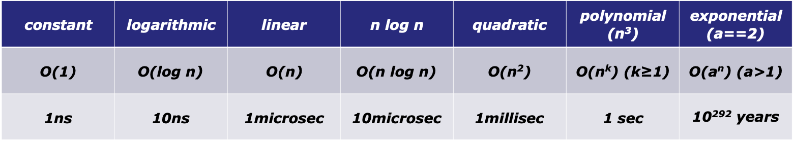
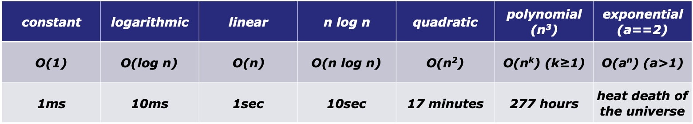

<!-- .slide: data-background="#111111" -->

# Powtórka

___

## Kwestia czasu...

### 1000 elementów

<!-- .element: class="fragment fade-in" -->

<!-- .element: class="fragment fade-in" -->

___

## Podsumowanie

Złożoności:

* <!-- .element: class="fragment fade-in" --> Stała <code>O(1)</code> - Nie zależy od długości
* <!-- .element: class="fragment fade-in" --> Logarytmiczna <code>O(logn)</code> - w każdym kroku obcinamy problem o część zależną od jego aktualnej długości (1/2, 1/3, 2/3, ...)
* <!-- .element: class="fragment fade-in" --> Stała <code>O(n)</code> - w każdym kroku redukujemy problem o stałą liczbę (1, 2, 3, ...). Standardowo jedna pętla.
* <!-- .element: class="fragment fade-in" --> Kwadratowa <code>O(n^2)</code> - zagnieżdżona pętla w pętli
* <!-- .element: class="fragment fade-in" --> Sześcienna <code>O(n^3)</code> - potrójnie zagnieżdżone pętle
* <!-- .element: class="fragment fade-in" --> Wykładnicza <code>O(2^n)</code> - redukujemy problem na dwa mniejsze podproblemy. Zazwyczaj rekurencja.
* <!-- .element: class="fragment fade-in" --> Wykładnicza <code>O(x^n)</code> - redukujemy problem na x mniejszych podproblemy. Zazwyczaj rekurencja.

___

## Przydatny link

[CS 106B Lecture 2: C++ Functions / Computational Complexity](https://web.stanford.edu/class/archive/cs/cs106b/cs106b.1176/lectures/2-Functions-BigO/2-FunctionsBigO.pdf)
