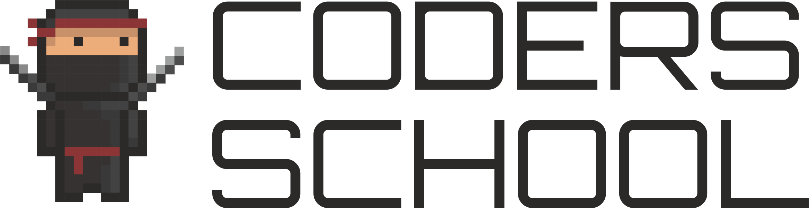

# STL

## [Kontenery Sekwencyjne](01-sequence-containers)

* [0x00 intro](01-sequence-containers/00-intro.md)
* [0x01 `std::vector<T>`](01-sequence-containers/01-vectormd)
* [0x02 `std::array<T, N>`](01-sequence-containers/02-array.md)
* [0x03 `std::list<T>`](01-sequence-containers/03-list.md)
* [0x04 `std::forward_list<T>`](01-sequence-containers/04-forward-list.md)
* [0x05 `std::deque<T>`](01-sequence-containers/05-deque.md)
* [0x06 Złożoność obliczeniowa](01-sequence-containers/06-complexity.md)
* [0x07 Powtórka](01-sequence-containers/07-recap.md)
* [0x08 Praca domowa](01-sequence-containers/08-homework.md)
