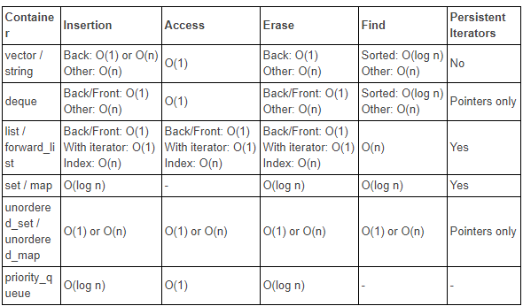

<!-- .slide: data-background="#111111" -->

# Associative containers

___

## Sorted

* <!-- .element: class="fragment fade-in" --> <code>set</code>
* <!-- .element: class="fragment fade-in" --> <code>multiset</code>
* <!-- .element: class="fragment fade-in" --> <code>map</code>
* <!-- .element: class="fragment fade-in" --> <code>multimap</code>

___

## Disordered

* <!-- .element: class="fragment fade-in" --> <code>unordered_set</code>
* <!-- .element: class="fragment fade-in" --> <code>unordered_multiset</code>
* <!-- .element: class="fragment fade-in" --> <code>unordered_map</code>
* <!-- .element: class="fragment fade-in" --> <code>unordered_multimap</code>

___

## Quiz

For what purpose can you use:

* <!-- .element: class="fragment fade-in" --> <code>set</code>?
* <!-- .element: class="fragment fade-in" --> <code>multiset</code>?
* <!-- .element: class="fragment fade-in" --> <code>map</code>?
* <!-- .element: class="fragment fade-in" --> <code>multimap</code>?
* <!-- .element: class="fragment fade-in" --> <code>unordered_set</code>?
* <!-- .element: class="fragment fade-in" --> <code>unordered_multiset</code>?
* <!-- .element: class="fragment fade-in" --> <code>unordered_map</code>?
* <!-- .element: class="fragment fade-in" --> <code>unordered_multimap</code>?

___

## Big `O` notation



___

## `std::map<K, T>` and `std::multimap<K, T>` traits #1

* <!-- .element: class="fragment fade-in" --> Form of binary tree (red-black tree)
* <!-- .element: class="fragment fade-in" --> It is not cache friendly
* <!-- .element: class="fragment fade-in" --> Allows you to store a key-value pair
* <!-- .element: class="fragment fade-in" --> A multimap can have many of the same keys
* <!-- .element: class="fragment fade-in" --> Map has unique keys
* <!-- .element: class="fragment fade-in" --> The alternative to a multimap is <code>std::map&lt;key, std::vector&lt;value&gt;&gt;</code>

___
<!-- .slide: style="font-size: 0.95em" -->

## `std::map<K, T>` and `std::multimap<K, T>` traits #2

Since it is implemented mostly as a red-black tree (GNU standard C++ library), the time to insert, delete and add an element is `O(log(n))`.

Advantages:
<!-- .element: class="fragment fade-in" -->

* <!-- .element: class="fragment fade-in" --> Quick search for items (sequence containers <code>O(n)</code>),
* <!-- .element: class="fragment fade-in" --> Relatively fast time to add and remove them, e.g. <code>std::vector&lt;T&gt;</code> adds items in the middle in time <code>O(n)</code> but <code>std::list&lt;T&gt;</code> (if an iterator is given) over time <code>O(1)</code>. Hence the map is relatively fast both to add and remove.
* <!-- .element: class="fragment fade-in" --> Perfect when we frequently search for data and less frequently add or delete it.

If we use it as a regular container, we will lose efficiency. The map should be used when you really want to have key-value pairs and search for them often. Otherwise, we can use `std::vector<pair<K, V>>` or another container.
<!-- .element: class="fragment fade-in" -->

___

## `std::map<K, T>` and `std::multimap<K, T>` methods

* <!-- .element: class="fragment fade-in" --> adding an item: <code>insert()</code>, <code>emplace()</code>, <code>emplace_hint()</code>. Additionally, the map has: <code>insert_or_assign()</code>, <code>try_emplace()</code> and <code>operator[]</code> (additive modifying)
* <!-- .element: class="fragment fade-in" --> modifying/accessing an item: <code>at()</code>, <code>operator[]</code> (Multimap does not have such options)
* <!-- .element: class="fragment fade-in" --> first/last item: None
* <!-- .element: class="fragment fade-in" --> size/is the container empty: <code>size()</code>, <code>empty()</code>
* <!-- .element: class="fragment fade-in" --> clear unused memory: None
* <!-- .element: class="fragment fade-in" --> start/end iterator: <code>begin()</code>, <code>end()</code>

___

## `std::map<K, T>` and `std::multimap<K, T>` methods #2

* <!-- .element: class="fragment fade-in" --> reverse iterator: <code>rbegin()</code>, <code>rend()</code>
* <!-- .element: class="fragment fade-in" --> constant iterator: <code>cbegin()</code>, <code>cend()</code>, <code>crbegin()</code>, <code>crend()</code>
* <!-- .element: class="fragment fade-in" --> container cleaning: <code>clear()</code>
* <!-- .element: class="fragment fade-in" --> preparing item for removal: None
* <!-- .element: class="fragment fade-in" --> erasing items from memory: <code>erase()</code>
* <!-- .element: class="fragment fade-in" --> replacement of the entire container: <code>swap()</code>
* <!-- .element: class="fragment fade-in" --> counting elements matching a given key: <code>count()</code> (for the map it is 0 or 1, for the multimap from 0 to n)
* <!-- .element: class="fragment fade-in" --> finding an element with a given key: <code>find()</code>

___

## Example of `emplace_hint` usage

```cpp
int main() {
    std::map<int, std::string> map;

    auto it = map.begin();
    map.emplace_hint(it, 10, "Ten");

    std::cout << map[10] << '\n';
}
```
<!-- .element: class="fragment fade-in" -->

Output:
`Ten`
<!-- .element: class="fragment fade-in" -->

We suggest the place where the element should be inserted on the map, thanks to which such an operation will be `O(1)`. However, if we give a wrong prompt, the insertion time will be `O(log(n))`. Rather rarely used 🙂
<!-- .element: class="fragment fade-in" -->

___

### Example of `insert_or_assign` usage

```C++
int main() {
    std::map<int, std::string> map;

    auto it = map.begin();
    map.insert_or_assign(it, 10, "Ten");
    std::cout << map[10] << '\n';
    map.insert_or_assign(it, 10, "Dziesiec");
    std::cout << map[10] << '\n';
    map[10] = "Cent";
    std::cout << map[10] << '\n';
}
```
<!-- .element: class="fragment fade-in" -->

Output:
<!-- .element: class="fragment fade-in" -->

```C++
Ten
Dziesiec
Cent
```
<!-- .element: class="fragment fade-in" -->

___

### Example of `count` usage

```C++
int main() {
    std::multimap<int, std::string> map;

    map.insert({5, "Five"});
    map.insert({5, "Funf"});
    map.insert({5, "Piec"});
    map.insert({5, "Cinq"});
    std::cout << map.count(5) << '\n';
}
```
<!-- .element: class="fragment fade-in" -->

Output: `4`
<!-- .element: class="fragment fade-in" -->

___

### Example of `find` usage

```C++
int main() {
    std::multimap<int, std::string> map;

    map.insert({5, "Five"});
    map.insert({5, "Funf"});
    map.insert({5, "Piec"});
    map.insert({5, "Cinq"});
    auto it = map.find(5);

    for (; it != map.end() ; ++it) {
        std::cout << it->first << " | " << it->second << '\n';
    }
}
```
<!-- .element: class="fragment fade-in" -->

Output:
<!-- .element: class="fragment fade-in" -->

```C++
5 | Five
5 | Funf
5 | Piec
5 | Cinq
```
<!-- .element: class="fragment fade-in" -->

___

## Task 1

* <!-- .element: class="fragment fade-in" --> Create a multimap and fill it with the given values

```C++
map.insert({5, "Ala"});
map.insert({5, "Ma"});
map.insert({5, "Kota"});
map.insert({5, "A"});
map.insert({5, "Kot"});
map.insert({5, "Ma"});
map.insert({5, "Ale"});
```
<!-- .element: class="fragment fade-in" -->

* <!-- .element: class="fragment fade-in" --> Write a function that will display words in a map with the number of characters equal to 3.

___

## Solution

```C++
std::vector<std::pair<int, std::string>> result;
std::copy_if(it,
             end(map),
             std::back_inserter(result),
             [](const auto& pair) { return pair.second.size() == 3; });
std::for_each(begin(result),
              end(result),
              [](const auto& pair) { std::cout << pair.second << '\n'; });
```
<!-- .element: class="fragment fade-in" -->

___

## `std::set<T>` and `std::multiset<T>` traits #1

* <!-- .element: class="fragment fade-in" --> Form of binary tree (red-black tree)
* <!-- .element: class="fragment fade-in" --> It is not cache friendly
* <!-- .element: class="fragment fade-in" --> Lets you store values ​​in an ordered order
* <!-- .element: class="fragment fade-in" --> A multiset can have many of the same values
* <!-- .element: class="fragment fade-in" --> Set has unique values
* <!-- .element: class="fragment fade-in" --> An alternative to multiset is sorted <code>std::vector&lt;T&gt;</code>

___
<!-- .slide: style="font-size: 0.95em" -->

## `std::set<T>` and `std::multiset<T>` traits #2

Since it is implemented mostly as a red-black tree (GNU standard C ++ library), the time to insert, delete and add an element is `O(log(n))`.

Advantages:
<!-- .element: class="fragment fade-in" -->

* <!-- .element: class="fragment fade-in" --> Quick search for items (sequential containers <code>O(n)</code>),
* <!-- .element: class="fragment fade-in" --> Relatively fast time to add and remove them, e.g. <code>std::vector&lt;T&gt;</code> adds items in the middle in time <code>O(n)</code> but <code>std::list&lt;T&gt;</code> (if an iterator is given) over time <code>O(1)</code>. Hence <code>set</code> it is relatively fast in both adding and removing.
* <!-- .element: class="fragment fade-in" --> Perfect when you want to always have sorted values.

If we do not want the container to be always sorted, but only at specific times, then maybe it's better to use it `std::vector<T>` and sort it when the need arises. If we also care only sometimes for unique values, then we can use `std::unique()`.
<!-- .element: class="fragment fade-in" -->

___

## `std::set<T>` and `std::multiset<T>` methods #1

* <!-- .element: class="fragment fade-in" --> adding an item: <code>insert()</code>, <code>emplace()</code>, <code>emplace_hint()</code>
* <!-- .element: class="fragment fade-in" --> modifying / accessing an item: None
* <!-- .element: class="fragment fade-in" --> first / last item: None
* <!-- .element: class="fragment fade-in" --> size / is the container empty: <code>size()</code>, <code>empty()</code>
* <!-- .element: class="fragment fade-in" --> clear unused memory: None
* <!-- .element: class="fragment fade-in" --> start / end iterator: <code>begin()</code>, <code>end()</code>
* <!-- .element: class="fragment fade-in" --> reverse iterator: <code>rbegin()</code>, <code>rend()</code>

<!-- ciacham -->
___

## `std::set<T>` and `std::multiset<T>` methods #2

* <!-- .element: class="fragment fade-in" --> constant iterator: <code>cbegin()</code>, <code>cend()</code>, <code>crbegin()</code>, <code>crend()</code>
* <!-- .element: class="fragment fade-in" --> container cleaning: <code>clear()</code>
* <!-- .element: class="fragment fade-in" --> preparing item for removal: None
* <!-- .element: class="fragment fade-in" --> erasing items from memory: <code>erase()</code>
* <!-- .element: class="fragment fade-in" --> replacement of the entire container: <code>swap()</code>
* <!-- .element: class="fragment fade-in" --> counting elements matching a given key: <code>count()</code> (for <code>set</code> is 0 or 1 for <code>multiset</code> 0 to n)
* <!-- .element: class="fragment fade-in" --> finding an element with a given key: <code>find()</code>

___

## Example of `std::set<T>` usage

```C++
std::set<int> set {5, 4, 3, 2, 1, 0, 6, 8, 7};
for (const auto el : set) {
    std::cout << el << ' ';
}
std::cout << '\n';

std::set<int, std::greater<int>> set2 {5, 4, 3, 2, 1, 0, 6, 8, 7};
for (const auto el : set2) {
    std::cout << el << ' ';
}
std::cout << '\n';
```
<!-- .element: class="fragment fade-in" -->

Output:
<!-- .element: class="fragment fade-in" -->

```C++
0 1 2 3 4 5 6 7 8
8 7 6 5 4 3 2 1 0
```
<!-- .element: class="fragment fade-in" -->

___

## Example of `std::multiset<T>` usage

```C++
std::multiset<int> set {5, 4, 3, 2, 1, 0, 6, 8, 7, 1, 2, 3, 4, 5, 6};
for (const auto el : set) {
    std::cout << el << ' ';
}
std::cout << '\n';

std::multiset<int, std::greater<int>> set2 {5, 4, 3, 2, 1, 0, 6, 8, 7, 1, 2, 3, 4, 5, 6};
for (const auto el : set2) {
    std::cout << el << ' ';
}
std::cout << '\n';
```
<!-- .element: class="fragment fade-in" -->

Output:
<!-- .element: class="fragment fade-in" -->

```C++
0 1 1 2 2 3 3 4 4 5 5 6 6 7 8
8 7 6 6 5 5 4 4 3 3 2 2 1 1 0
```
<!-- .element: class="fragment fade-in" -->

___

## Hash Table

<image src="img/chainedHashing.png">

___
<!-- .slide: style="font-size: 0.8em" -->

## Hash function

It is a function that will generate an index for the array from any object. Its most important feature is that it must always generate the same index for the same input data. Another important feature is generating the index in such a way that it can be repeated for only one combination, e.g.

```C++
size_t hash(const std::string& str) { return str.size(); }
```
<!-- .element: class="fragment fade-in" -->

```C++
size_t hash(const std::string& str) {
    size_t index = 0;
    for (size_t i = 0 ; i < str.size() ; ++i) {
        index += (int)str[i];
    }
    return index;
}
```
<!-- .element: class="fragment fade-in" -->

```C++
size_t hash(const std::string& str) {
    size_t index = 0;
    for (size_t i = 0 ; i < str.size() - 1 ; ++i) {
        index += ((int)str[i] * int(str[i + 1]) * (i + 5)) & (((int)str[i] + int(str[i + 1]) * i * i));
    }
    return index * str.size();
}
```
<!-- .element: class="fragment fade-in" -->

Rate hash functions.
<!-- .element: class="fragment fade-in" -->
___

## `std::unordered_set<T>` and `std::unordered_multiset<T>` traits #1

* <!-- .element: class="fragment fade-in" --> The hash array form.
* <!-- .element: class="fragment fade-in" --> It may or may not be cache friendly. Hash tables are often created in the form of a hybrid <code>std::vector&lt;T&gt;</code> and <code>std::list&lt;T&gt;</code>.
* <!-- .element: class="fragment fade-in" --> The values ​​are not sorted
* <!-- .element: class="fragment fade-in" --> A multiset can have many of the same values
* <!-- .element: class="fragment fade-in" --> Set has unique values

___

## `std::unordered_set<T>` and `std::unordered_multiset<T>` traits #2

Since it is implemented as a hash table, the average time it takes to add, remove, access and modify it `O(1)`. The worst time for all operations is `O(n)`.

Advantages:
<!-- .element: class="fragment fade-in" -->

* <!-- .element: class="fragment fade-in" --> Instantly search for items
* <!-- .element: class="fragment fade-in" --> Lightning fast time to add and remove them
* <!-- .element: class="fragment fade-in" --> Assuming we have a good hash function, of course.

Perfect for read-only containers. Reading time `O(1)`.
Great for containers with a good mixing function. Time to add, access and modify `O(1)`.
<!-- .element: class="fragment fade-in" -->

___

## `std::unordered_set<T>` and `std::unordered_multiset<T>` methods

* <!-- .element: class="fragment fade-in" --> adding an item: <code>insert()</code>, <code>emplace()</code>, <code>emplace_hint()</code>
* <!-- .element: class="fragment fade-in" --> modifying/accessing an item: None
* <!-- .element: class="fragment fade-in" --> first/last item: None
* <!-- .element: class="fragment fade-in" --> size/is the container empty: <code>size()</code>, <code>empty()</code>
* <!-- .element: class="fragment fade-in" --> clear unused memory: None
* <!-- .element: class="fragment fade-in" --> start/end iterator: <code>begin()</code>, <code>end()</code>
* <!-- .element: class="fragment fade-in" --> reverse iterator: None

___

## `std::unordered_set<T>` and `std::unordered_multiset<T>` methods #2

* <!-- .element: class="fragment fade-in" --> constant iterator: <code>cbegin()</code>, <code>cend()</code>
* <!-- .element: class="fragment fade-in" --> container cleaning: <code>clear()</code>
* <!-- .element: class="fragment fade-in" --> preparing item for removal: None
* <!-- .element: class="fragment fade-in" --> erasing items from memory: <code>erase()</code>
* <!-- .element: class="fragment fade-in" --> replacement of the entire container: <code>swap()</code>
* <!-- .element: class="fragment fade-in" --> counting elements matching a given key: <code>count()</code> (for <code>set</code> is 0 or 1 for <code>multiset</code> 0 to n)
* <!-- .element: class="fragment fade-in" --> finding an element with a given key: <code>find()</code>

___

## Example of `std::unordered_set<T>` and `std::unordered_multiset<T>` usage

```C++
std::unordered_set<std::string> set{"Ala", "Ma", "Kota", "A", "Kot", "Ma", "ALE"};
for (const auto el : set) {
    std::cout << el << ' ';
}
std::cout << '\n';
set.insert("Ala");
set.insert("Ala");
set.insert("Ala");
for (const auto el : set) {
    std::cout << el << ' ';
}
std::cout << '\n';
```
<!-- .element: class="fragment fade-in" -->

___

## `unordered_map<K, T>` and `unordered_multimap<K, T>`

* <!-- .element: class="fragment fade-in" --> Guess the features
* <!-- .element: class="fragment fade-in" --> Guess the implementation,
* <!-- .element: class="fragment fade-in" --> Send an example using these 2 containers

___

## Task 2

* <!-- .element: class="fragment fade-in" --> Create <code>std::unordered_map&lt;int, std::string&gt;</code> and <code>std::multiset&lt;int&gt;</code>
* <!-- .element: class="fragment fade-in" --> Fill them with whatever values ​​you want
* <!-- .element: class="fragment fade-in" --> Delete one of the elements,
* <!-- .element: class="fragment fade-in" --> add an additional item
* <!-- .element: class="fragment fade-in" --> Delete items according to the predicate you invented.

___

## Q&A
